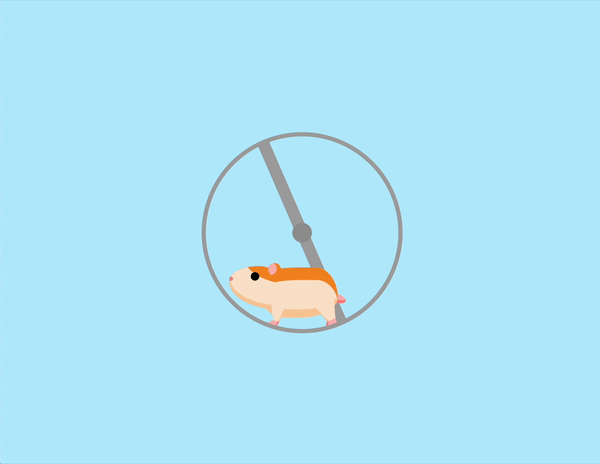

# 🐹 Hamster Wheel Animation

This project features an animated hamster running in a wheel, showcasing detailed CSS animations.

## 📦 Technologies

Built with:

- `HTML:` Markup language for creating the structure.
- `CSS:` For styling and animations.

## ⚙️ Getting Started

To view and interact with the Hamster Wheel animation:

1. Download the project files.
2. Open the `index.html` file in Visual Studio Code.
3. Use the Live Server extension in VS Code to view the project in your web browser.

## 🖱️ Interaction

Open the project in your browser to see the animated hamster running in the wheel.

## 🛣️ Project Structure

Here are the key files and their purposes:

- **index.html**: The main HTML file containing the structure of the Hamster Wheel animation.
- **style.css**: The CSS file that styles the hamster and wheel and adds animations.

Feel free to explore and customize these files to suit your needs!

## 📱 Responsive Design

- The Hamster Wheel animation is responsive, ensuring a seamless experience on both desktops and mobile devices.

## 🔄 Animations

The Hamster Wheel animation includes various CSS animations. Here’s an overview:

- **Wheel Rotation**: The wheel rotates continuously.
- **Hamster Movement**: The hamster and its limbs move realistically as it runs in the wheel.
